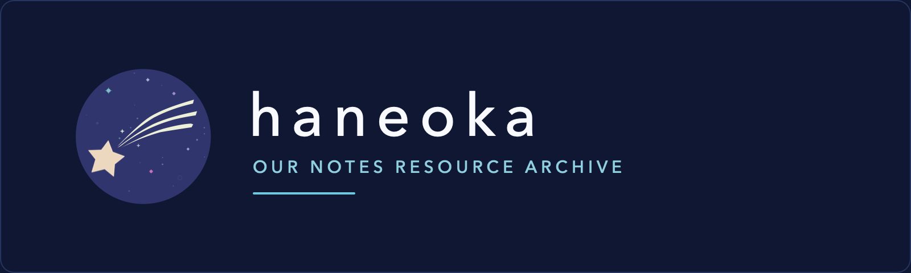

<p align="center">
  
</p>

# Haneoka

[](https://github.com/haneoka-gakuen/haneoka/actions/workflows/ci.yml)
[](https://github.com/haneoka-gakuen/haneoka/actions/workflows/deploy-cloudflare.yml)
[](LICENSE)

Unofficial resource archive and browser viewer for _BanG Dream! Our Notes_.

- [Catalog](https://haneoka.org/catalog)
- Searchable multilingual game data
- Audio, video, comic, Live2D, story, and asset viewers
- Interactive chart player and chart editor
- ADV story playback and authoring
- Sonolus-compatible play, watch, preview, and tutorial engines
- Accounts and community features

## Development

Requirements:

- Node.js 24 and Corepack
- Python 3.13, FFmpeg, and `vgmstream-cli` when processing resources
- A modern WebGL2 browser for interactive renderers

```sh
corepack enable
pnpm install --frozen-lockfile
pnpm typecheck
pnpm lint
HANEOKA_CUBISM_RUNTIME_POLICY=optional pnpm build
```

Run the application and Worker locally:

```sh
cp .dev.vars.example .dev.vars
pnpm db:schema:bootstrap:local
pnpm dev:worker
```

For a static build with the local catalog preview server:

```sh
pnpm build
HOST=127.0.0.1 PORT=3000 pnpm preview
```

A complete catalog requires an authorized resource release. Build one with the
[resource pipeline](scripts/README.md), or set `RESOURCE_RELEASE_ROOT` to an
existing release directory. Cubism playback also requires an authorized
runtime at the path printed by `pnpm runtime:cubism:source-path`, or through
`HANEOKA_CUBISM_RUNTIME_DIR`.

Use `pnpm dev:offline` to prevent network requests. For Bestdori content,
provide a local mirror containing `api/`, `assets/`, and `res/`:

```sh
BESTDORI_RAW_MIRROR_ROOT=/absolute/path/to/bestdori-mirror pnpm dev:offline:full
```

## Data and deployment

- Catalog documents and media are stored as immutable releases in R2.
- Accounts and community data use D1.
- Production schema changes use committed migrations under
  [`worker/database`](worker/database/README.md).
- Production deployment is defined in `wrangler.jsonc` and
  `.github/workflows/deploy-cloudflare.yml`.

Forks must configure their own Cloudflare Worker, D1 database, R2 buckets,
email sender, Turnstile widget, OAuth applications, domains, and secrets.
Never commit credentials, private packages, or licensed runtime files.

## Contributing

See [CONTRIBUTING.md](CONTRIBUTING.md), [SUPPORT.md](SUPPORT.md), and
[SECURITY.md](SECURITY.md).

## License

Haneoka-authored files are licensed under [MPL-2.0](LICENSE) unless noted
otherwise. Third-party runtimes, adapted code, fonts, icons, and game materials
retain their own terms; see [THIRD_PARTY_NOTICES.md](THIRD_PARTY_NOTICES.md).

Haneoka is an unofficial project and is not affiliated with or endorsed by the
rights holders of _BanG Dream!_ or _BanG Dream! Our Notes_.
